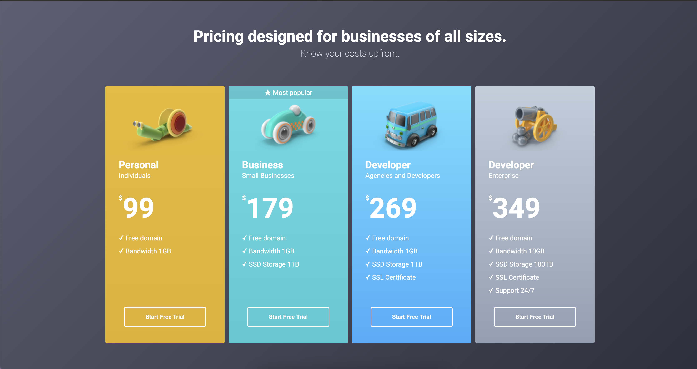

# Projekt - cennik
[Kliknij tutaj aby rozwiązać zadanie](https://githubbox.com/Publishing-School/css-projekt-cennik)

Wykorzystaj zmienne CSS, przykładowe uzycie: color: var(--primary-color)
[zobacz dokumentacje](https://developer.mozilla.org/en-US/docs/Web/CSS/Using_CSS_custom_properties).
Zmienne CSS dostępne są w pliku style.css.

Zadanie zaimplementowane bazując na makiecie:
https://www.figma.com/file/1f4NgqiFTluJLJt1de4Hdl/Colorful-Pricing-Table-(Freebie)-(Community)?type=design&node-id=0%3A115&mode=dev&t=r79y0m85FpUePyKE-1

Rozwiązanie

Stan dynamiczny
